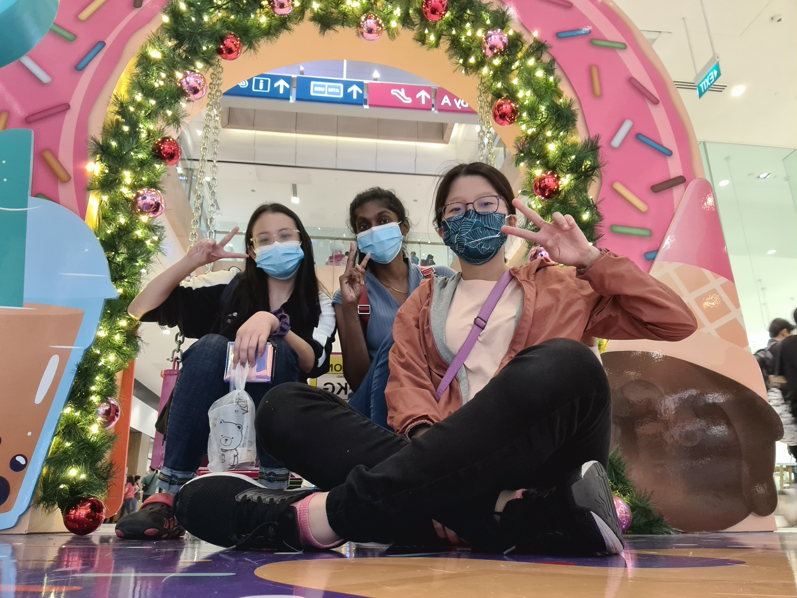
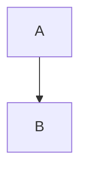
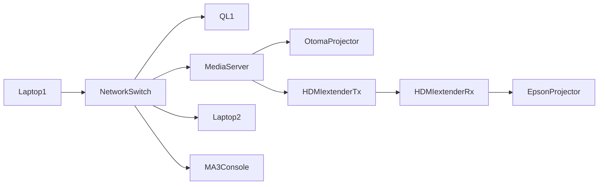

# EGL315TeamA

## Name

Yi Shan

*Yi Shan*

**Yi Shan**

***Yi Shan***


## School
There are 2 ways to insert codes

### Code block
```
I am at Nanyang Poly 
Block S 540
```
### Code Line
'sudo raspi-config'


## Adding pictures 

This is a picture of an outing with my friends




## Block Diagram





##
